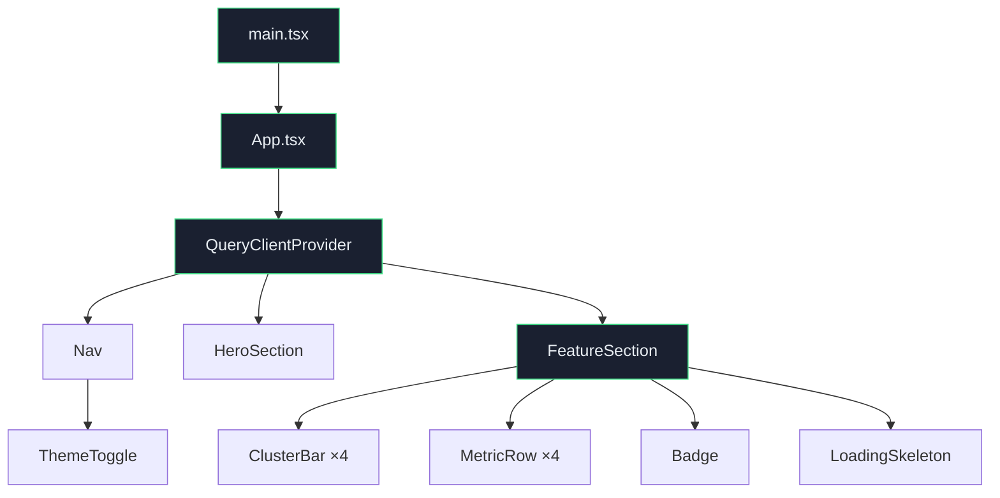
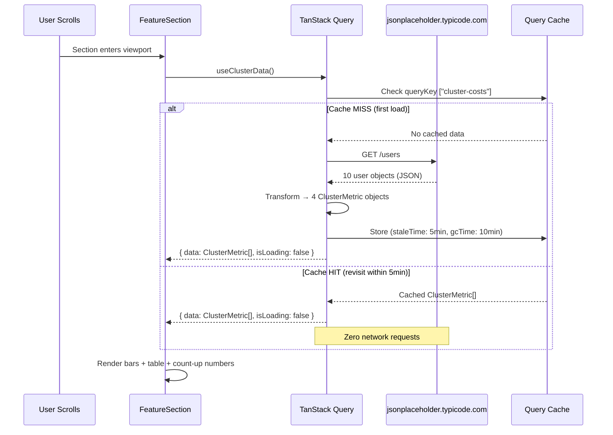
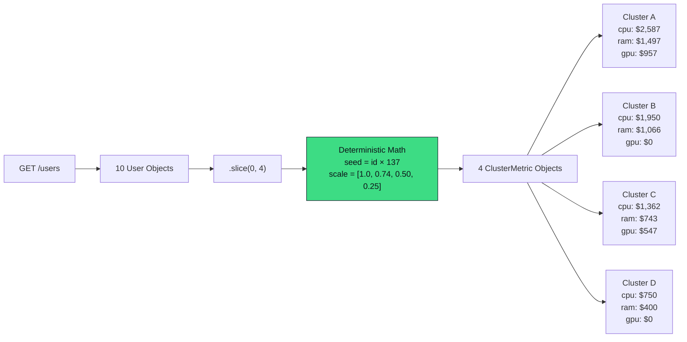
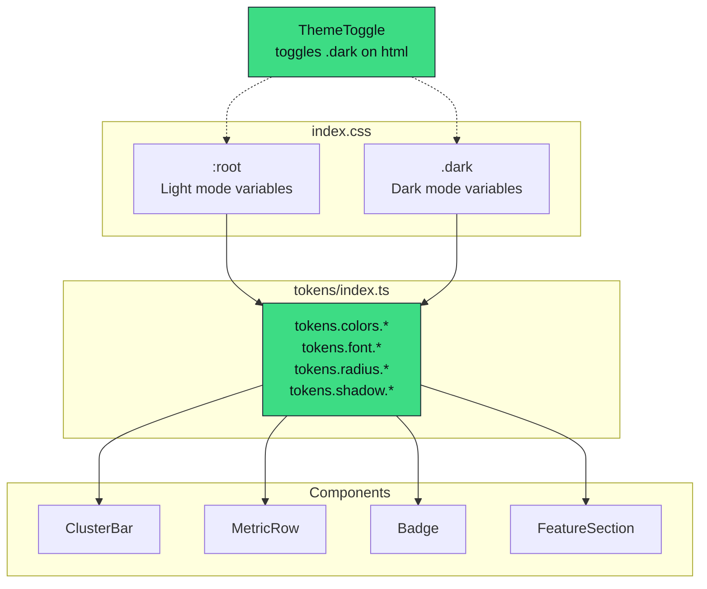
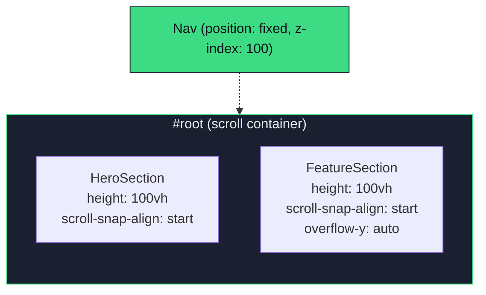

# Atomity — Cluster Cost Intelligence

**React 18 · TypeScript · Framer Motion · TanStack Query v5 · Tailwind CSS · Vite**

A scroll-snap, single-page dashboard that visualises cloud cluster costs with animated bar charts, interactive table breakdowns, and count-up numbers — all powered by a real API call cached via TanStack Query.

---

## Quick Start

```bash
npm install
npm run dev        # → http://localhost:5173
```

```bash
npm run build      # production build
npm run preview    # preview the build locally
```

---

## Architecture Overview



---

## Data Flow — API Call to Render



### API Transform Pipeline



---

## Animation Sequence

All animations are **scroll-triggered** via `useInView` — nothing animates on page load.

```mermaid
gantt
    title Animation Timeline (after scroll into view)
    dateFormat X
    axisFormat %Lms

    section Entrance
    Header fade + slide up       :h, 0, 600
    Dashboard card fade in       :c, 150, 700

    section Bars
    Bar A grow + count-up        :b1, 100, 900
    Bar B grow + count-up        :b2, 200, 900
    Bar C grow + count-up        :b3, 300, 900
    Bar D grow + count-up        :b4, 400, 900

    section Table
    Row 1 slide in               :r1, 500, 450
    Row 2 slide in               :r2, 590, 450
    Row 3 slide in               :r3, 680, 450
    Row 4 slide in               :r4, 770, 450

    section Details
    Divider scale                :d, 700, 600
    Live Data badge              :lb, 800, 300
    Total Spend KPI              :ts, 1000, 300
    Footer note                  :fn, 1200, 300
```



Every animation respects `prefers-reduced-motion: reduce` — values appear instantly with zero motion.

---

## Token & Theming Architecture



**Zero hardcoded hex values in components.** Every color, shadow, and radius is read from `tokens`, which reference CSS custom properties. Dark mode works by toggling `.dark` on `<html>` — all values swap automatically via CSS.

---

## Scroll Snap Layout



The `#root` div is the scroll container with `scroll-snap-type: y mandatory`. Each section snaps to fill the full viewport. The FeatureSection has internal `overflow-y: auto` so the chart + table can scroll within its snap panel.

---

## Project Structure

```
atomity-challenge/
├── index.html                 ← Google Fonts (Inter variable), app shell
├── package.json               ← dependencies, scripts
├── vite.config.ts             ← Vite + React plugin
├── tailwind.config.js         ← Tailwind configuration
├── tsconfig.json              ← TypeScript strict mode
└── src/
    ├── main.tsx               ← React 18 createRoot
    ├── App.tsx                ← QueryClientProvider, Nav, layout
    ├── index.css              ← CSS variables, tokens, scroll-snap, responsive
    ├── tokens/
    │   └── index.ts           ← Design tokens (colors, fonts, radii, shadows)
    ├── hooks/
    │   ├── useClusterData.ts  ← TanStack Query: fetch, transform, cache
    │   └── useCountUp.ts      ← RAF-based number animation with easing
    └── components/
        ├── HeroSection.tsx    ← Above-the-fold hero with scroll CTA
        ├── FeatureSection.tsx ← Dashboard: bars + table + KPI
        ├── ClusterBar.tsx     ← Animated vertical bar with hover spring
        ├── MetricRow.tsx      ← Table row with count-up cells + hover
        ├── Badge.tsx          ← Pill labels (5 variants)
        ├── ThemeToggle.tsx    ← Dark/light mode toggle (localStorage)
        └── LoadingSkeleton.tsx← Pulsing placeholder during fetch
```

---

## Key Technical Decisions

| Decision | Reasoning |
|---|---|
| **Inter as sole font** | Variable font (100–900 weight), `font-feature-settings` for UI alternates (`cv02–cv11`), `tabular-nums` for aligned cost columns |
| **CSS Grid for card header** | `grid-template-columns: 1fr auto` keeps Total Spend KPI pinned top-right on all screen sizes |
| **`useCountUp` custom hook** | 30-line `requestAnimationFrame` loop with cubic ease-out — no library dependency for number animation |
| **JSONPlaceholder `/users`** | No public cloud cost API exists without auth. Deterministic transform on user data produces realistic, stable cluster metrics |
| **`layoutId` for bar indicator** | Framer Motion animates the active-bar highlight between bars with zero manual positioning |
| **`color-mix()` for derived colors** | Dimmed accents and hover tints computed in CSS — no pre-calculated values needed |
| **Mandatory scroll-snap** | Full-page sections with `scroll-snap-type: y mandatory` create a focused, app-like navigation feel |

---

## Accessibility

- `prefers-reduced-motion: reduce` — all Framer Motion animations and CSS transitions are disabled
- `aria-label` on sections, nav, bar chart, and table
- `aria-pressed` on bar buttons for active state
- `aria-live="polite"` on the active cluster info strip
- `role="alert"` on error states
- `role="img"` with label on the bar chart region
- Semantic `<table>`, `<thead>`, `<th scope="col">` for the cost breakdown
- Keyboard-focusable bar buttons and theme toggle

---

## Responsive Breakpoints

| Width | Behaviour |
|---|---|
| **1280px+** | Full desktop layout, max-width 1200px centered |
| **768px** | Tighter padding, smaller card border-radius, compact card padding |
| **480px** | Reduced display font size, smaller section labels, minimal inline padding |
| **All widths** | `clamp()` on every font-size and padding for fluid scaling between breakpoints |

---

## Caching Strategy

```
First visit:
  Browser → GET /users → 200 OK → Transform → Render → Cache (5min stale, 10min GC)

Revisit within 5 minutes:
  Browser → Cache HIT → Instant render → Zero network requests

Revisit after 5 minutes (but within 10):
  Browser → Cache (stale) → Instant render → Background refetch → Silent update

Revisit after 10 minutes:
  Browser → Cache MISS → Fresh fetch → Loading skeleton → Render
```

Open DevTools Network tab to verify: you'll see exactly **one** request on first load, then none on subsequent navigations.

---

## Scripts

| Command | Description |
|---|---|
| `npm run dev` | Start Vite dev server with HMR |
| `npm run build` | TypeScript check + production build |
| `npm run preview` | Preview the production build locally |

---

## Deploy

```bash
npm run build
# Push to GitHub → Import on vercel.com → Auto-deploys on push
```

Or any static host — the build output is a standard `dist/` folder with `index.html` + hashed assets.
