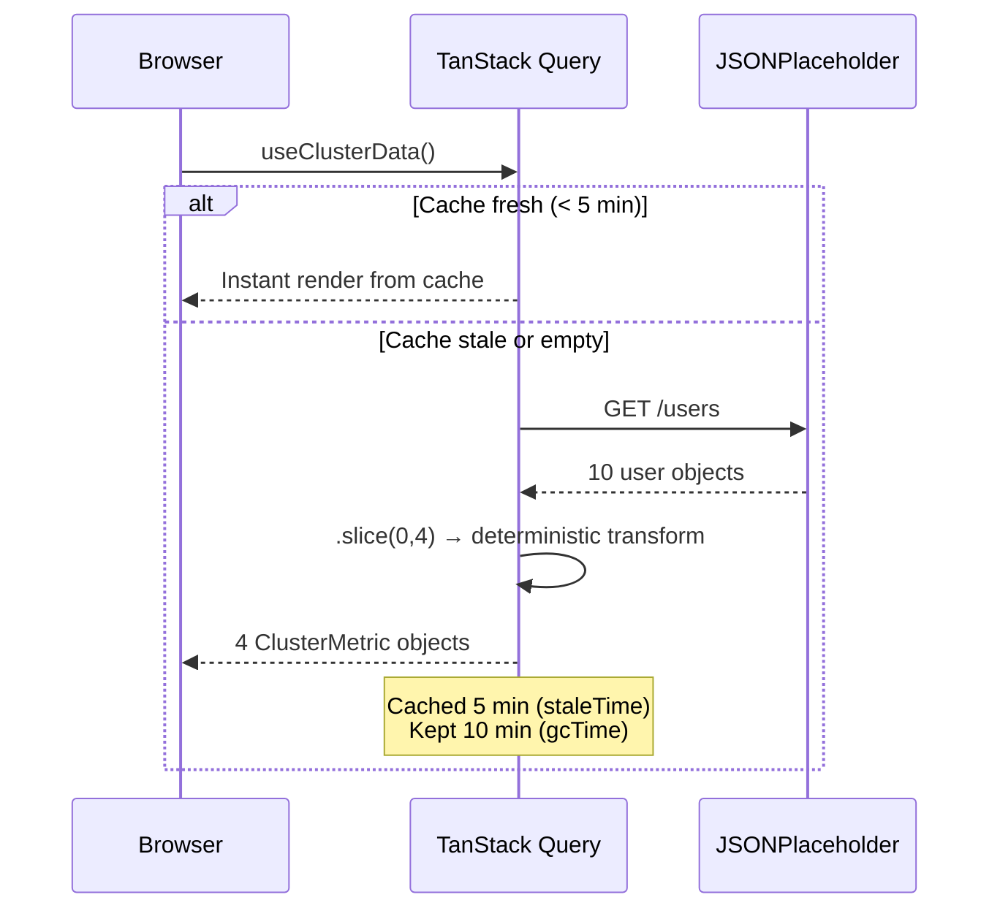
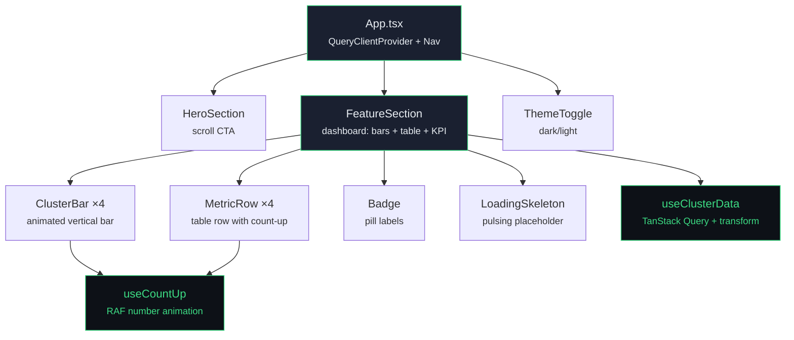

# Atomity Frontend Challenge — Cluster Cost Intelligence

**Option A** (0:30–0:40) · React 18 · TypeScript · Framer Motion · TanStack Query v5 · Tailwind CSS · Vite

---

## Which Feature & Why

I chose **Option A** — the cluster cost breakdown with a bar chart and detailed cost table. Three reasons:

1. **Rich animation surface** — bars growing upward, table rows staggering in from the left, dollar values counting up from zero, hover feedback with spring physics, and a sliding `layoutId` indicator between active bars. This gives me more opportunities to demonstrate scroll-triggered, physically-natural motion than a simpler card layout would.
2. **Real data story** — cost figures (CPU, RAM, Storage, Network, GPU per cluster) map cleanly to an API response and back, making the fetch → transform → render pipeline feel genuine.
3. **Interactive depth** — clicking any bar highlights that cluster across both the chart and the table simultaneously, filtering the view. This goes beyond what the reference video shows and adds a "we didn't expect that" interaction layer.

---

## Approach to Animation

Every animation is **scroll-triggered** using Framer Motion's `useInView` hook with `{ once: true, margin: '-80px' }`. Nothing animates on page load — the user must scroll the FeatureSection into view before anything moves.

The animation sequence is deliberately choreographed:

| Step | Element | Delay | Duration | Effect |
|------|---------|-------|----------|--------|
| 1 | Section heading | 0ms | 600ms | Fade up (y: 32 → 0) |
| 2 | Dashboard card | 150ms | 700ms | Fade up (y: 40 → 0) |
| 3 | Bars A → D | 100ms stagger | 900ms each | Height grows from 0%, count-up numbers |
| 4 | Table rows 1 → 4 | 90ms stagger | 450ms each | Slide in from left (x: -16 → 0) |
| 5 | Divider | 700ms | 600ms | Scale X from 0 to 1 |
| 6 | KPI + badges | 800–1200ms | 300ms | Fade in |

All easing uses `[0.23, 1, 0.32, 1]` — a custom cubic-bezier that accelerates quickly then decelerates slowly, creating motion that feels physically natural rather than mechanical.

**Hover interactions:**
- `ClusterBar` — `whileHover: scale 1.03` / `whileTap: scale 0.97` with spring physics (`stiffness: 300, damping: 20`). Bar fill opacity transitions from 0.85 → 1 on hover via CSS.
- `MetricRow` — background color transitions to `--color-bg-card-hover` on mouse enter.
- Active bar selection — `layoutId="bar-indicator"` makes a white stripe animate smoothly between bars without manual positioning.

**Count-up numbers** — a custom `useCountUp` hook uses `requestAnimationFrame` with cubic ease-out (`1 - (1 - progress)³`) to animate dollar values from 0 to their target. This runs in the same scroll-triggered cycle as the bars.

**Reduced motion** — every animation checks `prefers-reduced-motion: reduce`. When set, Framer Motion props are empty objects (`initial={}`), `useCountUp` jumps instantly to the target value, and CSS transitions are forced to `0.01ms` via a global media query.

---

## Token & Style Architecture

### Design tokens — defined once, referenced everywhere

```
src/tokens/index.ts    →  TypeScript constants referencing CSS variable names
src/index.css :root    →  Light mode CSS custom properties
src/index.css .dark    →  Dark mode CSS custom properties (toggled via class on <html>)
```

No component contains a hardcoded hex value. Every color, shadow, radius, and font-family is read from `tokens.*`, which maps to `var(--color-*)` / `var(--shadow-*)`. Dark mode works by toggling `.dark` on `<html>` — all token values swap automatically.

Derived colors use `color-mix()` in CSS rather than pre-computed values:
```css
--color-accent-green-dim: color-mix(in srgb, #3ddc84 20%, transparent);
```

### Modern CSS features used

| Feature | Where | Why |
|---------|-------|-----|
| `clamp()` | Every font-size, padding, and gap | Fluid scaling between breakpoints without media queries |
| `color-mix()` | Dimmed accent colors, dark mode tints | Dynamic color derivation — no extra variables needed |
| CSS custom properties | Full token system + dark mode | Single source of truth for all design values |
| `container-type` + `@container` | `ClusterBar` label adapts at small widths | Component-level responsiveness, not viewport-level |
| Logical properties | `padding-inline`, `max-inline-size`, `margin-inline` | Writing-direction-aware layout |
| `scroll-snap-type: y mandatory` | `#root` container | Full-page snap scrolling between hero and dashboard |
| `font-feature-settings` | Inter variable font | `cv02`, `cv03`, `cv04`, `cv11` for UI-optimized alternates |
| `font-variant-numeric: tabular-nums` | All dollar and percentage columns | Column-aligned numbers in the cost table |

### Typography

Inter is loaded as a variable font (weight 100–900, optical sizing 14–32) via a single Google Fonts request. It's the sole typeface — used for display headings, body text, labels, and numeric data. `font-feature-settings` enables Inter's contextual alternates for a sharper UI appearance, and `tabular-nums` ensures financial figures align perfectly in table columns.

---

## Data Fetching & Caching

### The pipeline



No cloud cost API exists publicly without auth keys. I transform JSONPlaceholder user data deterministically — same input always produces the same output — so the data looks realistic and stable across page loads.

### TanStack Query v5 caching

```ts
useQuery({
  queryKey: ['cluster-costs'],
  queryFn: fetchClusterData,
  staleTime: 5 * 60 * 1000,    // 5 minutes — no refetch on remount
  gcTime: 10 * 60 * 1000,      // 10 minutes — kept in memory
  retry: 2,
})
```

**What to verify in DevTools Network tab:**
- First visit: exactly **1 request** to `/users`, then loading skeleton → full UI
- Revisit within 5 minutes: **0 requests**, instant render from cache
- After 5 minutes: background refetch, UI updates silently
- After 10 minutes: fresh fetch, skeleton shows briefly

Three async states are handled explicitly:
- **Loading** → pulsing skeleton placeholder (animated bars + table rows)
- **Error** → alert message with `role="alert"`
- **Success** → full interactive dashboard

---

## Component Structure



```
src/
  tokens/
    index.ts                   ← design tokens (colors, fonts, radii, shadows)
  hooks/
    useClusterData.ts          ← TanStack Query + API transform + cache config
    useCountUp.ts              ← RAF number animation with cubic ease-out
  components/
    HeroSection.tsx            ← above-the-fold hero with scroll CTA
    FeatureSection.tsx         ← main dashboard: header, bars, table, KPI
    ClusterBar.tsx             ← single animated vertical bar + hover spring
    MetricRow.tsx              ← table row with count-up cells + hover highlight
    Badge.tsx                  ← pill label component (5 variants)
    ThemeToggle.tsx            ← dark/light toggle (persisted to localStorage)
    LoadingSkeleton.tsx        ← pulsing placeholder during fetch
  App.tsx                      ← QueryClientProvider + Nav + layout
  main.tsx                     ← React 18 createRoot
  index.css                    ← CSS tokens, scroll-snap, responsive breakpoints
```

Every UI element is **built from scratch** — no MUI, Chakra, shadcn, or any pre-built component library. The Badge, bars, table rows, skeleton, and theme toggle are all custom.

---

## Libraries & Why

| Library | Version | Reason |
|---------|---------|--------|
| React | 18 | Required by challenge |
| TypeScript | 5 | Type-safe props, API response shapes, `as const` token inference |
| Framer Motion | 11 | `useInView` for scroll triggers, `motion.div` for declarative animation, `layoutId` for shared layout transitions, `whileHover`/`whileTap` for interaction springs |
| TanStack Query | 5 | Declarative async state (loading/error/success), `staleTime`/`gcTime` for smart caching, zero redundant fetches |
| Tailwind CSS | 3.4 | Utility classes for quick layout scaffolding alongside custom CSS |
| Vite | 5 | Fast dev server, instant HMR, optimized production builds |

---

## Responsive Layout

| Breakpoint | Adaptations |
|------------|-------------|
| **1280px+** | Full layout, `max-inline-size: 1200px` centered |
| **768px** | Tighter wrapper padding (`1rem`), smaller card border-radius (`12px`), compact card padding |
| **480px** | Minimal inline padding (`0.75rem`), reduced display font size, smaller section labels |
| **All sizes** | `clamp()` on every font-size, padding, gap, and bar height for fluid scaling |

The bar chart uses `flex: 1` per bar with `clamp(3px, 1vw, 12px)` gaps — bars compress gracefully. The cost table scrolls horizontally on mobile with `-webkit-overflow-scrolling: touch`. The card header uses CSS Grid (`1fr auto`) so the Total Spend KPI stays pinned top-right at any width.

Container queries on `.cluster-card-container` resize bar labels independently of the viewport.

---

## Accessibility

- **Semantic HTML** — `<section>`, `<nav>`, `<main>`, `<table>`, `<thead>`, `<th scope="col">`, `<button>`
- **ARIA** — `aria-label` on sections/nav/chart, `aria-pressed` on bar buttons, `aria-live="polite"` on active cluster strip, `role="alert"` on error state, `role="img"` on bar chart region
- **Reduced motion** — `prefers-reduced-motion: reduce` disables all Framer Motion animations and CSS transitions globally
- **Color contrast** — light mode text is near-black (`#080d0a`), muted text is `#5a5f58` (passes WCAG AA on `#f0f1ec` background)
- **Keyboard** — all bar buttons and the theme toggle are keyboard-focusable and operable

---

## Dark Mode

Implemented via a `.dark` class toggled on `<html>` by `ThemeToggle`. User preference is persisted to `localStorage` and respects `prefers-color-scheme: dark` on first visit.

All token values swap automatically — components don't need any conditional logic for dark/light. `color-mix()` handles derived colors in both modes.

---

## Tradeoffs & Decisions

| Decision | Tradeoff |
|----------|----------|
| JSONPlaceholder instead of a real cloud API | No public cost API exists without auth keys. Deterministic transform on user data gives realistic, stable numbers. |
| Single page with two snap sections | The brief says "a polished single section beats a rough full page." I focused depth into one interactive dashboard rather than breadth across multiple pages. |
| `useCountUp` custom hook instead of a library | 30 lines of `requestAnimationFrame` + cubic easing. Shows understanding of animation fundamentals without adding a dependency. |
| Inter as the sole typeface | Variable font covers weights 100–900 in a single file. `tabular-nums` and OpenType features give it the precision needed for financial data. Eliminated the need for separate display and mono fonts. |
| `layoutId` for the active bar indicator | Framer Motion handles the position interpolation automatically. Zero manual calculation for the sliding highlight. |
| CSS Grid for card header instead of flexbox | `grid-template-columns: 1fr auto` keeps the KPI pinned right on all screen sizes. Flexbox `wrap` caused it to drop below badges on mobile. |
| Mandatory scroll-snap | Creates a focused, app-like feel. The FeatureSection has internal `overflow-y: auto` so the chart + table can scroll within its snap panel. |

---

## What I'd Improve With More Time

1. **Grouping toggle** — switch between "by Cluster" and "by Service" views with animated bar transitions using `AnimatePresence`
2. **Time range filter** — Last 7 / 30 / 90 days with a real API that returns different data sets
3. **Sparklines** — tiny inline trend charts inside each table row showing cost over time
4. **Keyboard navigation** — arrow keys to move active cluster selection between bars
5. **React Query DevTools** — visible in development for easy demo of cache behaviour during review
6. **E2E tests** — Playwright tests for scroll-trigger firing, bar click filtering, and dark mode toggle

---

## Running Locally

```bash
npm install
npm run dev          # → http://localhost:5173
```

## Production Build

```bash
npm run build        # TypeScript check + Vite production build
npm run preview      # Preview the build locally
```

## Deploy

```bash
npm run build
# Push to GitHub → Import on vercel.com → Auto-deploys on every push
```
