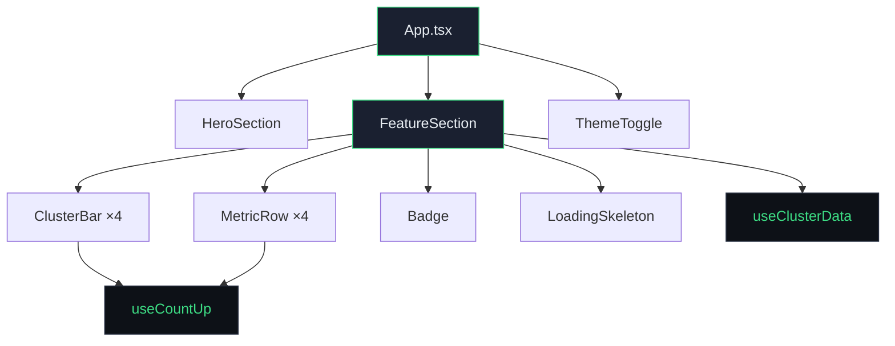
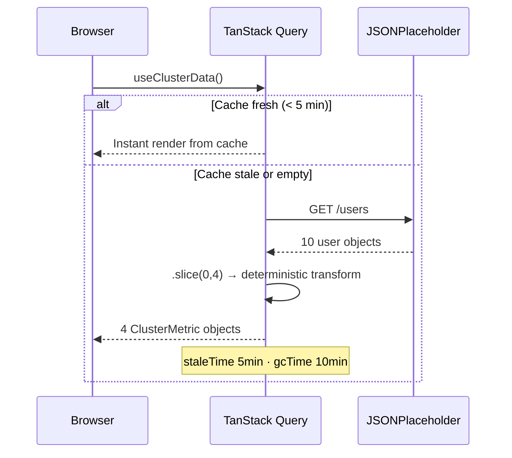

# Atomity Frontend Challenge — Cluster Cost Intelligence

**Option A** (0:30–0:40) · React 18 · TypeScript · Framer Motion · TanStack Query · Tailwind · Vite

---

## Feature Choice

**Option A** — cluster cost bar chart + breakdown table. Chosen for: (1) rich animation surface (scroll-triggered bars, staggered rows, count-up numbers, hover springs, `layoutId` indicator), (2) data fetch → transform → render pipeline, (3) interactive bar click to highlight cluster across chart and table.

---

## Animation

Scroll-triggered via Framer Motion `useInView` (`once: true`). Sequence: heading → card → bars (100ms stagger) → table rows (90ms stagger) → divider → KPI. Easing: `[0.23, 1, 0.32, 1]`. Hover: bars scale 1.03/0.97 with spring; rows get background highlight. Count-up: custom `useCountUp` with RAF + cubic ease-out. **`prefers-reduced-motion`** respected (animations disabled, count-up jumps to target).

---

## Tokens & CSS

**Tokens:** `src/tokens/index.ts` → CSS vars in `:root` / `.dark`. No hardcoded hex. `color-mix()` for derived colors.

**Modern CSS:** `clamp()`, `color-mix()`, container queries, logical properties, scroll-snap, `tabular-nums`. Inter variable font.

---

## Architecture



All UI built from scratch — no MUI, Chakra, shadcn.

---

## Data Flow



JSONPlaceholder `/users` → deterministic transform → `ClusterMetric`. States: Loading (skeleton), Error (alert), Success (dashboard).

---

## Libraries

| Library | Purpose |
|---------|---------|
| Framer Motion | `useInView`, `motion.div`, `layoutId`, `whileHover`/`whileTap` |
| TanStack Query | Async state, `staleTime`/`gcTime` caching |
| Tailwind | Layout scaffolding |
| Vite | Dev server, build |

---

## Responsive & A11y

**Breakpoints:** 1280px (full), 768px (tighter padding), 480px (compact). `clamp()` everywhere. Grid for KPI; horizontal scroll for table on mobile. **A11y:** semantic HTML, ARIA, `prefers-reduced-motion`, contrast, keyboard focus.

---

## Tradeoffs

- **JSONPlaceholder** — no public cloud API; deterministic transform from users → cost metrics
- **Custom `useCountUp`** — RAF + cubic easing, no extra dep
- **Inter only** — variable font, `tabular-nums` for numbers
- **CSS Grid for header** — KPI pinned right on mobile (flex wrapped)

---

## With More Time

Time range filter, sparklines in rows, keyboard nav between bars, E2E tests (Playwright).

---

## Run

```bash
npm install && npm run dev    # → localhost:5173
npm run build && npm run preview
```

Deploy: push to GitHub → Vercel auto-deploys.
